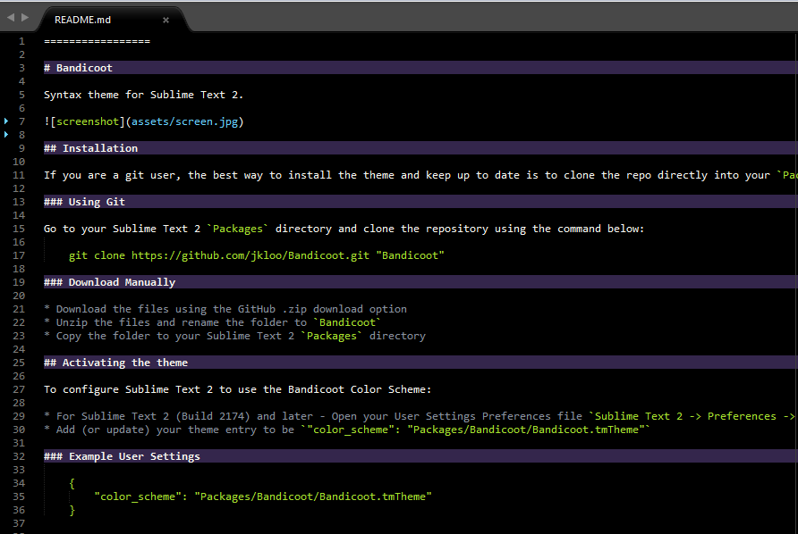
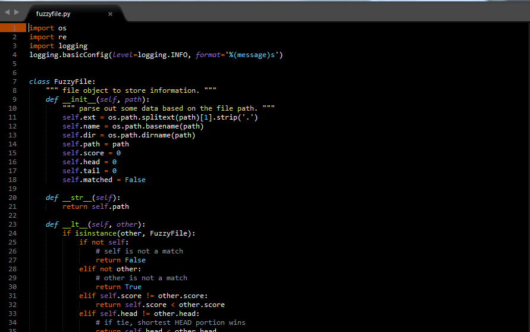

=================

# Bandicoot

Syntax theme for Sublime Text

 Markdown Highlighting

 Python Highlighting

## Installation

If you are a git user, the best way to install the theme and keep up to date is to clone the repo directly into your `Packages` directory in the Sublime Text 2 application settings area.

### Using Git

Go to your Sublime Text `Packages` directory and clone the repository using the command below:

    git clone https://github.com/jkloo/Bandicoot.git "Bandicoot"

### Download Manually

* Download the files using the GitHub .zip download option
* Unzip the files and rename the folder to `Bandicoot`
* Copy the folder to your Sublime Text `Packages` directory

## Activating the theme

To configure Sublime Text to use the Bandicoot Color Scheme:

* For Sublime Text 2 (Build 2174) and later - Open your User Settings Preferences file `Sublime Text 2 -> Preferences -> Settings - User`. For earlier builds - Open your User Global Settings Preferences file `Sublime Text -> Preferences -> Global Settings - User`
* Add (or update) your theme entry to be `"color_scheme": "Packages/Bandicoot/Bandicoot.tmTheme"`

### Example User Settings

    {
        "color_scheme": "Packages/Bandicoot/Bandicoot.tmTheme"
    }
    

Thanks to Josh for the template!
